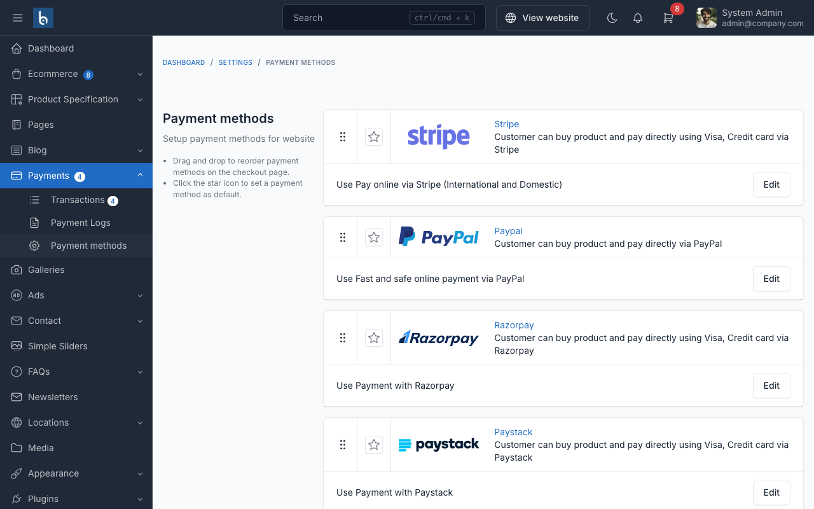

# Payment Gateways

SnapCart supports multiple payment gateways to accept payments from customers worldwide.

## Supported Payment Gateways

- **PayPal**: Accept payments via PayPal accounts and credit/debit cards
- **Stripe**: Accept credit/debit card payments directly on your store
- **Paystack**: Popular in Africa for card and mobile money payments
- **Razorpay**: Popular in India for UPI, cards, and netbanking
- **Mollie**: European payment methods including iDEAL, Bancontact, and more
- **SSLCommerz**: Bangladesh's leading payment gateway
- **Cash on Delivery (COD)**: Accept payment upon delivery
- **Bank Transfer**: Manual bank transfer payments

## Setup a Payment Gateway

1. In admin panel, go to `Ecommerce` -> `Payment Methods`
2. Find the payment gateway you want to enable
3. Click `Activate` and fill in the required credentials
4. Click `Save`

### PayPal Configuration

- **Client ID**: Your PayPal application client ID
- **Client Secret**: Your PayPal application secret
- **Mode**: Sandbox (testing) or Live (production)

### Stripe Configuration

- **Publishable Key**: Your Stripe publishable key
- **Secret Key**: Your Stripe secret key

::: warning
Always test payment gateways in sandbox/test mode before going live. Never share your secret keys publicly.
:::

## Managing Payments

All payments are tracked in `Ecommerce` -> `Payments` in the admin panel. You can view payment status, refund
payments, and manage transaction details.
