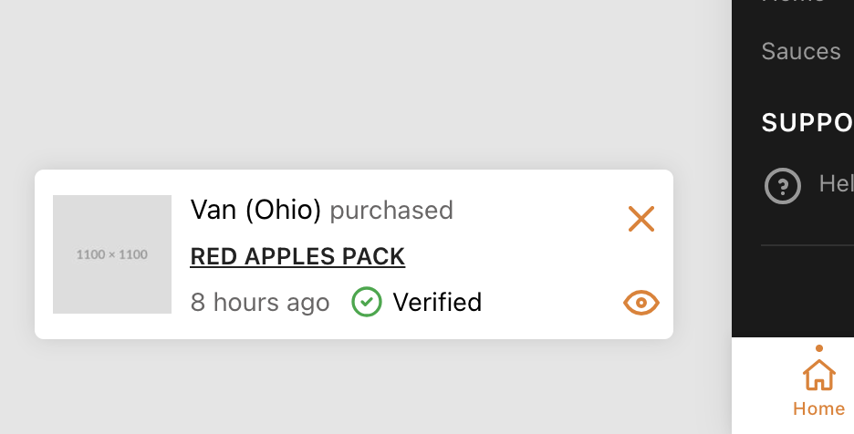

# Sale Popup

The Sale Popup feature displays a recurring notification showing recent purchases (e.g. "Someone in New York just bought...") to create social proof and urgency.

## Configuration

To manage the sale popup settings, go to **Settings → Ecommerce → Sale Popup** in the admin panel.

Options available:

- **Enable**: Toggle the popup on or off.
- **Popup Type**: Show real recent purchases or fake/simulated purchases.
- **Limit**: Maximum number of popup items to display per session.
- **Timeout**: The delay before the first popup appears.
- **Stay Time**: How long the popup remains visible on the screen.
