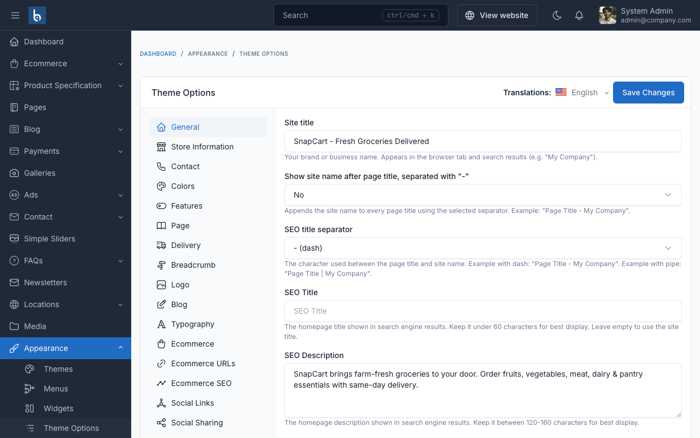
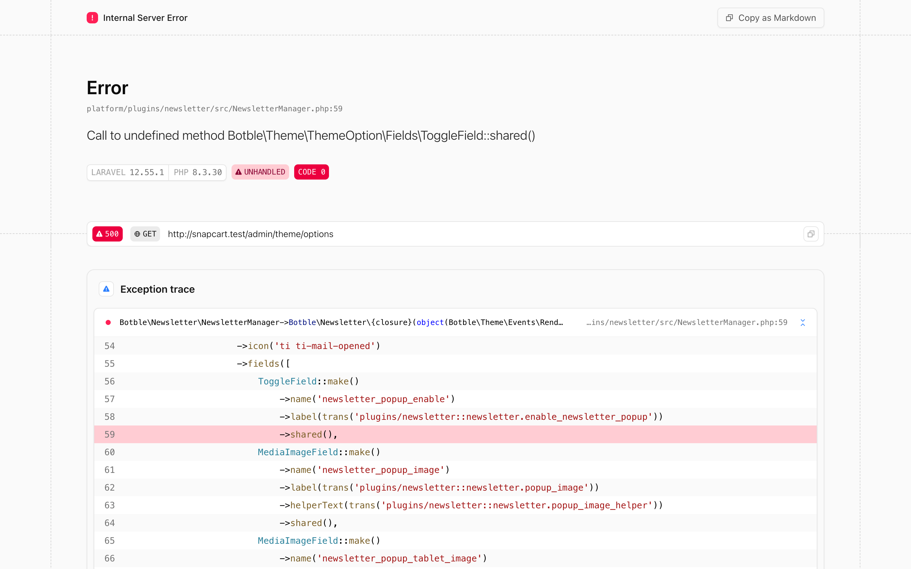

# Theme Options

Theme options allow you to customize SnapCart's appearance and behavior without editing code.

To access the theme options, go to `Appearance` -> `Theme Options` in your admin panel.

## General

The **General** tab allows you to configure your site's title, description, and other essential details.

## Store Information

Configure your store's physical address, rating display, and review count shown on the storefront.

- **Store Address**: Your store's physical or business address
- **Store Rating**: Display rating (e.g., 4.8)
- **Review Count**: Number of reviews to display

## Contact Information

Set up contact channels displayed on your store:

- **Phone Number**: Main contact phone
- **Zalo**: Zalo chat link
- **Facebook**: Facebook page URL
- **Messenger**: Facebook Messenger link

These are used by the [Floating Contact](./usage-floating-contact.md) feature.

## Colors

Customize SnapCart's color scheme to match your brand:

- **Primary Color**: Main accent color (default: `#ce4002`)
- **Secondary Color**: Secondary accent (default: `#ffc000`)
- **Text Color**: Body text color
- **Background Color**: Page background color

## Features

Toggle key SnapCart features on/off:

- **Buy Now Button**: Show a "Buy Now" button on product pages
- **Sticky Cart**: Display a sticky cart bar at the bottom of product pages
- **Floating Contact**: Show floating contact buttons (Zalo, Phone, Messenger)
- **Delivery Time Picker**: Enable delivery date/time selection at checkout
- **Product Reviews**: Enable customer reviews on product pages
- **Social Proof**: Display trust badges on product pages

## Ecommerce

Configure ecommerce-specific display options:

- **Sold Count Display**: Show how many units have been sold
- **Checkout Color**: Customize the checkout button color
- **SEO Titles**: Set custom SEO titles for product and category pages

## Delivery

Configure delivery time settings for the [Delivery Time Picker](./usage-delivery-time-picker.md):

- **Start Hour / End Hour**: Available delivery time window
- **Delivery Fees**: Standard and express delivery fees
- **Peak Hours**: Define peak hours with adjusted fees
- **Free Shipping Threshold**: Order amount for free shipping

## Social Links

Add your social media links displayed in the footer and contact sections:

- Facebook
- Instagram
- TikTok
- YouTube
- Twitter
