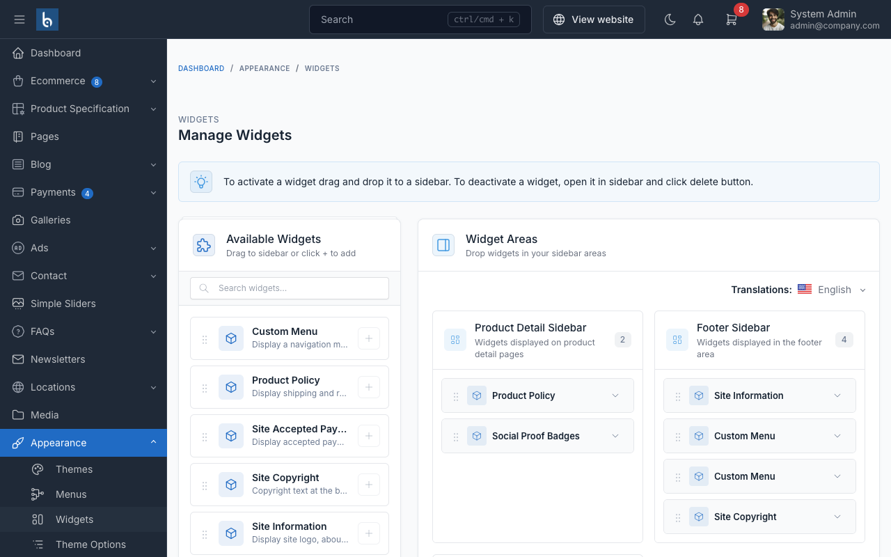

# Widgets

SnapCart provides widget areas to help you customize the user interface and organize content across your store.

## Manage Widgets

To manage the widgets, go to `Appearance` -> `Widgets` in the admin panel.

To add a widget to a sidebar, drag and drop the widget from the left side to the sidebar area on the right side.

## Widget Areas

### Product Details Sidebar

Located on the product details page, this area displays additional product information such as policies and trust
badges.

### Social Proof Widget

Displays 4 configurable trust badges on product pages:

- **Fast Delivery**: Delivery guarantee messaging
- **Quality Guarantee**: Product quality assurance
- **Easy Returns**: Return policy highlights
- **24/7 Support**: Customer support availability

Each badge has a customizable title and description.

### Product Policy Widget

Display product policies and guarantees. Configure policy items with icons and descriptions to build customer trust.

## Blog Sidebar

The blog sidebar appears on the right side of blog pages. Use this area to display widgets such as **Blog Search**,
**Recent Posts**, **Categories**, etc.
