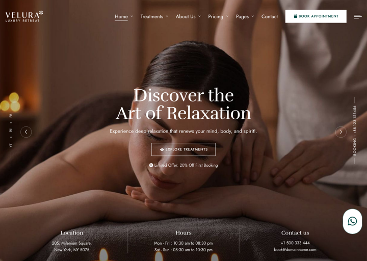
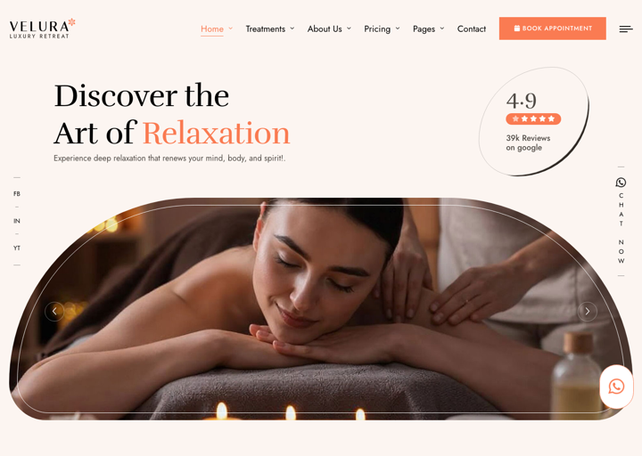
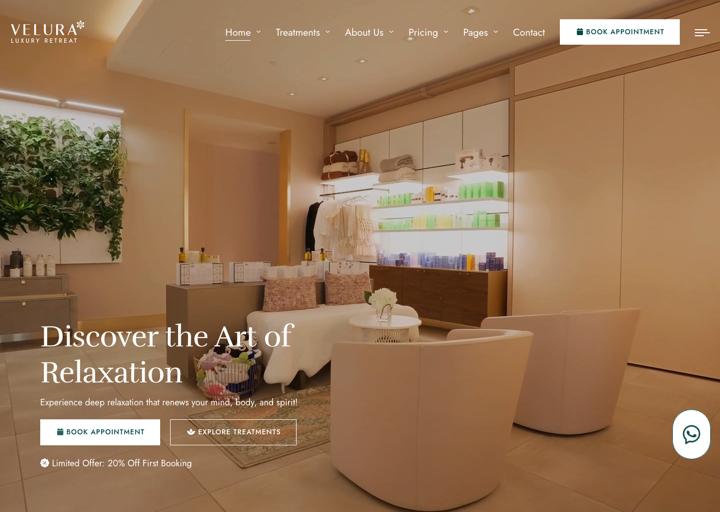
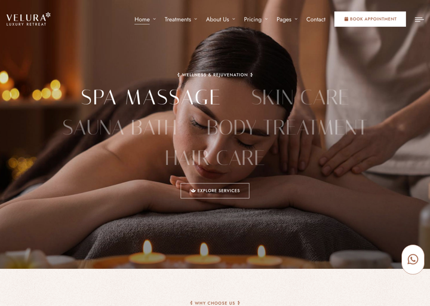
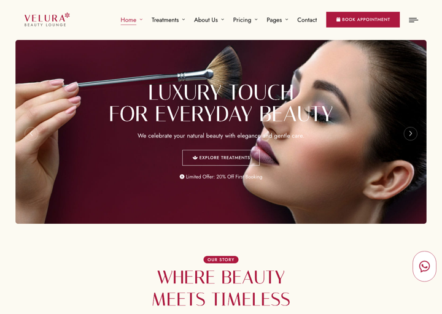
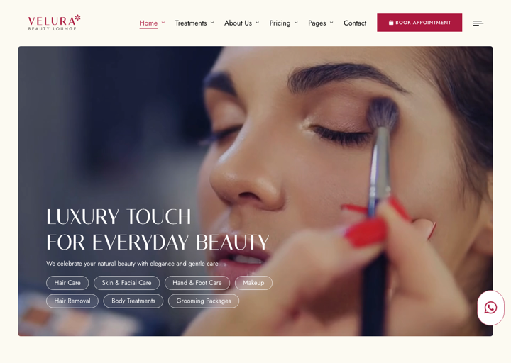
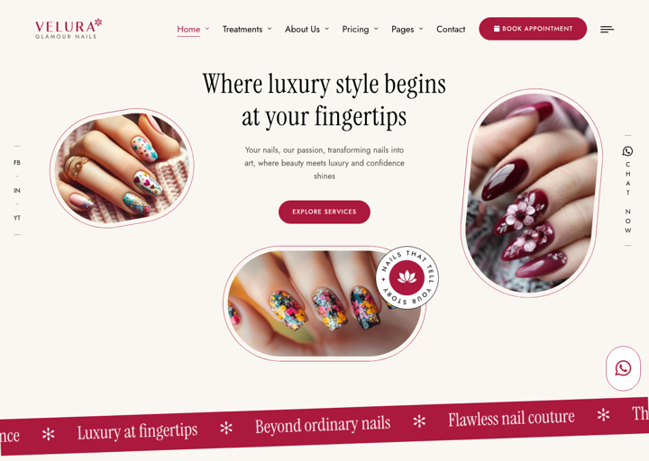
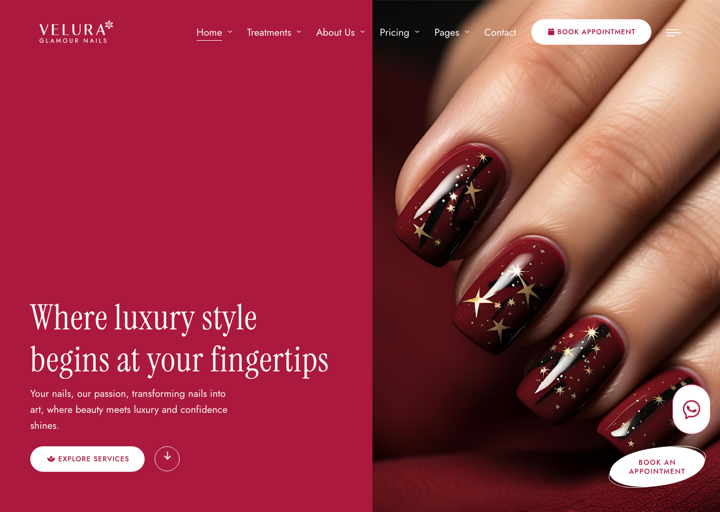
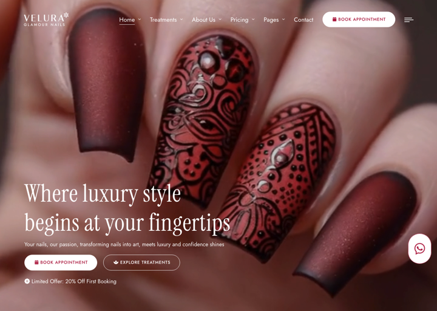
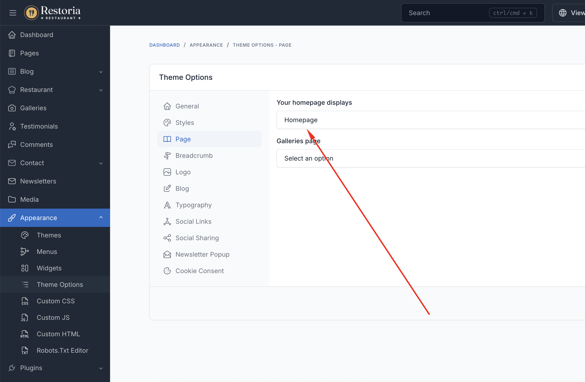

# Homepage

Homepage is the first page that clients see when they visit your spa or salon website. It sets the tone for your entire online presence and showcases your atmosphere, treatments, and unique offerings.

## Homepage Variations

Velura comes with **9 stunning homepage variations** (`Home 1` – `Home 9`) to match different spa, beauty, and nail
salon styles. Each preset arranges the available UI Blocks differently and uses its own hero style and color mood.

When installing the theme, you can pick one of the `Home 1` – `Home 9` presets in the CMS installer, or import the
full sample data to get all of them at once.

## Create Homepage

If you are using the sample data of **Velura**, all homepage variations are already created for you.

They are located in Admin -> Pages. You can skip this step if using sample data.

To create a new homepage, in the admin panel, go to `Pages` and click on the `Create` button.

In the `Create new page` page, fill in the following fields:

- **Title**: Enter the title of the page. For example, `Home` or `Home 2`.
- **Permalink**: You can customize this permalink. The main homepage permalink should be `/`.
- **Content**: You have the option to customize the content or utilize our pre-defined [UI Blocks](./usage-ui-block.md).
- **Template**: Select the appropriate page template.
- Other fields are optional, you can fill them if you want.

## Setup Homepage

After creating the homepage, you need to set it as the homepage of your website.

In the admin panel, go to `Appearance` -> `Theme Options` -> `Page`, and select the homepage you want to use in
the `Your homepage displays` field.

::: tip
If you are using the sample data of **Velura**, the homepage is already created and set up for you.
:::

## Customize Homepage

Please go to Admin -> Pages -> Homepage, and edit the homepage content.

The homepage can be customized using UI Blocks specifically designed for spa & beauty businesses:

### Essential Spa & Salon Sections

- **Hero Banner** - Showcase your spa with a stunning slider
- **About Section** - Tell your brand's story
- **Services Section** - Display your treatments with icons and descriptions
- **Why Choose Us** - Highlight features and key statistics
- **Reserve Section** - Let clients book appointments online
- **Staff Section** - Introduce your specialists and team
- **Packages Section** - Present bundled treatment packages
- **Memberships Section** - Show membership plans and pricing
- **Special Offer** - Highlight featured services in a carousel
- **Gallery Section** - Showcase your space and results
- **Testimonials Section** - Display client reviews with ratings
- **FAQ Section** - Answer common questions
- **Contact Section** - Show location, hours, and a contact form
- **News Section** - Feature the latest blog posts
- **Gift Voucher Section** - Promote gift vouchers
- **Newsletter Section** - Collect newsletter subscribers
- **Brand Logos** - Display an associated brand logos strip

A complete list of available shortcodes can be found in [UI Block](./usage-ui-block.md#available-shortcodes).
