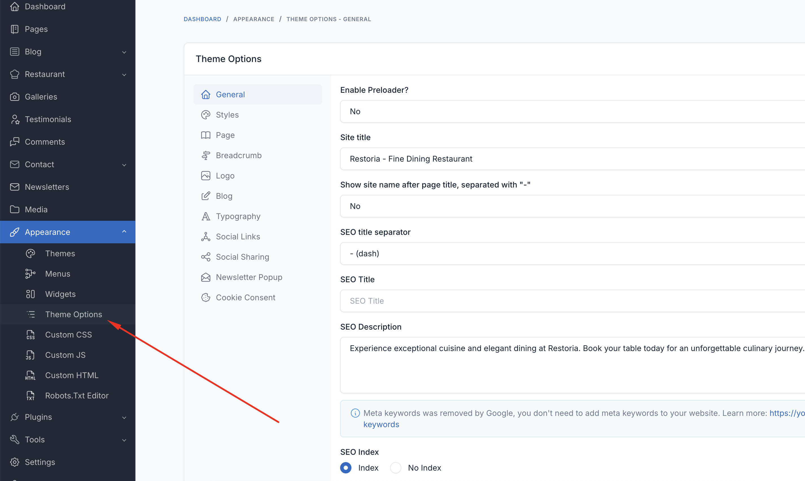
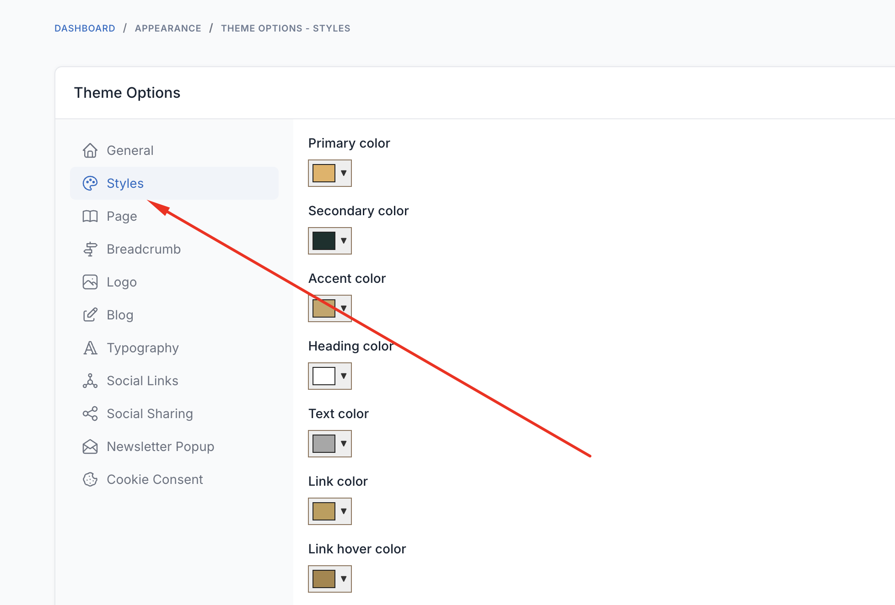
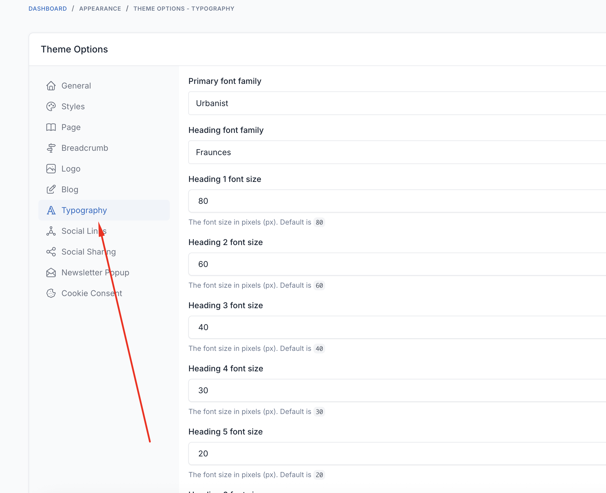
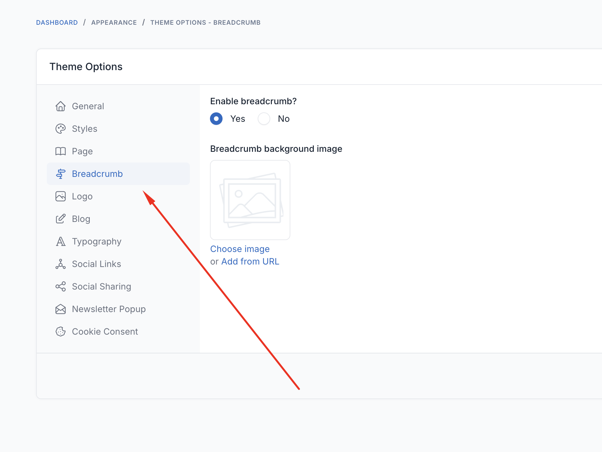

# Theme Options

Theme options allow you to customize every aspect of your Velura spa & beauty website without touching any code. Access these settings through **Appearance** → **Theme Options** in your admin panel.

## Header

Control the top area of every page.

- **Show Header Top**: Show or hide the top info bar (opening hours, phone, socials)
- **Show Book Appointment Button**: Toggle the call-to-action button in the header
- **Header Background Color**: Header background (defaults to transparent for hero overlap)
- **Header Text Color**: Header link and text color
- **Sticky Header Style**: Appearance of the header when it sticks on scroll
- **Menu Background / Text / Hover Color**: Colors for the navigation menu

## Footer

Control the colors of the footer area.

- **Footer Background Color**: Footer background
- **Footer Text Color**: Footer body text
- **Footer Link Color** and **Footer Link Hover Color**: Footer links
- **Footer Muted Text Color**: Secondary/muted footer text

## Blog

- **Blog List Layout**: Choose how blog post listings are displayed

## Styles

Customize the visual appearance of your website.

### Color Scheme
- **Primary Color**: Main brand color
- **Secondary Color**: Secondary brand color
- **Accent Color**: Accent/highlight color
- **Heading Color**: Titles and headings
- **Text Color**: Body text color
- **Link Color** and **Link Hover Color**: Hyperlink colors
- **Button Background / Text / Hover Colors**: Button styling
- **Border Color**: Borders and dividers

## Typography

Control fonts and text styling throughout your website. Velura ships with an elegant default pairing:

- **Primary (body) font**: `Jost`
- **Heading font**: `Rufina`

### Font Families
- **Primary Font**: Main body text font
- **Heading Font**: Titles and headings

### Font Sizes
- **Body Text**: Base font size (16-18px recommended)
- **H1 - H6**: Heading sizes

## Breadcrumbs

Configure the breadcrumb banner shown at the top of inner pages.

- **Breadcrumb Background Image**: Upload a custom background for the breadcrumb banner

::: tip
Logo, favicon, social links, copyright, and preloader are also configured under **Theme Options**. Remember to click
**Save** and clear the cache after changing any option.
:::
