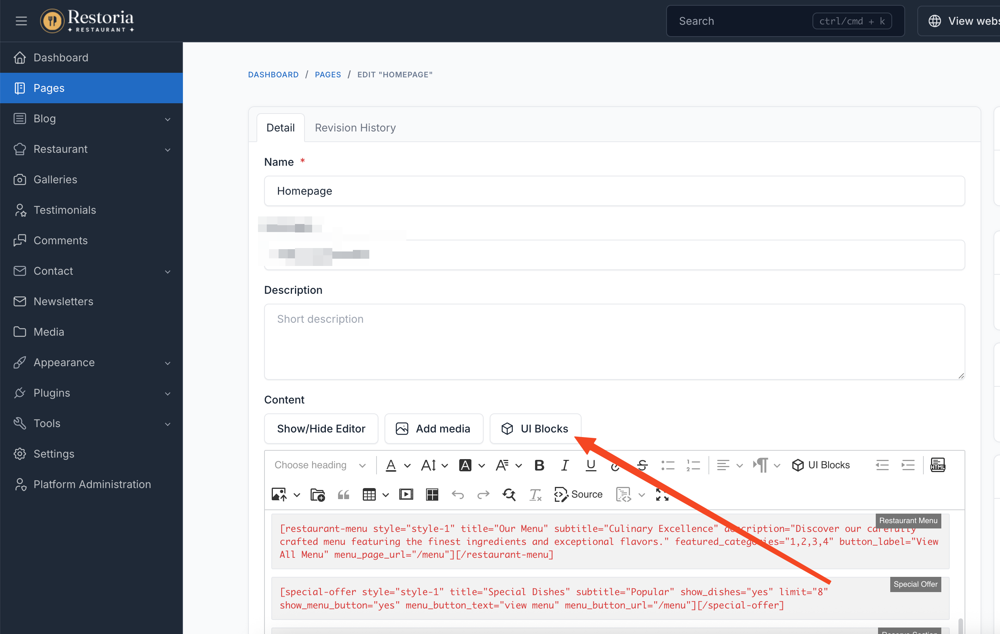
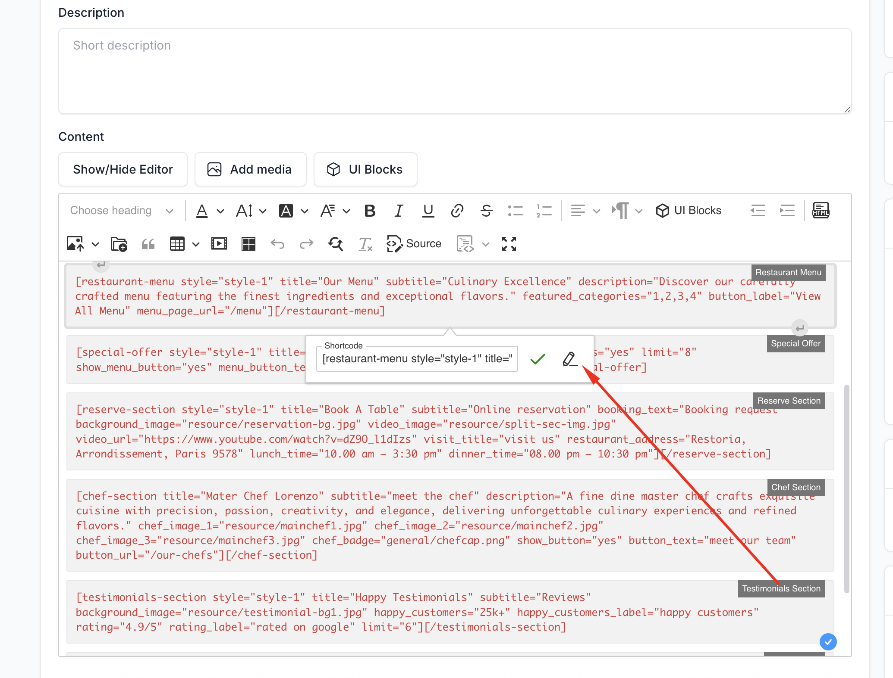

# UI Block

UI Blocks are pre-designed content sections that help you build beautiful spa & salon pages quickly. Velura provides specialized shortcodes tailored for the beauty and wellness industry.

## How to Use UI Blocks

### Adding UI Blocks to Pages

1. Navigate to **Pages** in your admin panel
2. Create a new page or edit an existing one
3. Click the **UI Block** button in the editor
4. Select the desired shortcode from the list
5. Configure the shortcode settings
6. Click **Insert** to add it to your page

### Editing UI Blocks

To modify an existing UI block:

1. Click on the shortcode in the editor
2. Select **Edit** from the toolbar
3. Update the settings as needed
4. Click **Update** to save changes

## Available Shortcodes

Velura ships with 15 UI Block shortcodes designed for spa, beauty, and nail salon websites:

| Shortcode | Description |
|-----------|-------------|
| **Hero Banner** | Display a hero banner with slider and call-to-action content |
| **About Section** | Introduce your spa with an about section |
| **Services Section** | Display spa services with icons and descriptions |
| **Why Choose Us** | Highlight features and key statistics |
| **Reserve Section** | Show the appointment booking form in a split layout |
| **Staff Section** | Present your specialists and team with photos |
| **Packages Section** | Display spa packages with their included services |
| **Memberships Section** | Show membership plans and pricing |
| **Special Offer** | Feature special services in a carousel |
| **Testimonials Section** | Display client testimonials with star ratings |
| **Gallery Section** | Show gallery images with a lightbox |
| **FAQ Section** | Frequently asked questions accordion |
| **Contact Section** | Display contact information with a contact form |
| **News Section** | Display the latest blog posts |
| **Spa Booking Menu** | Display spa booking service categories |

::: tip
Most spa-related shortcodes (Services, Packages, Memberships, Staff, Reserve, Spa Booking Menu) pull their data from
the **Spa Booking** section of the admin panel. See [Spa Booking](./usage-spa-booking.md) to set up your catalog first.
:::
