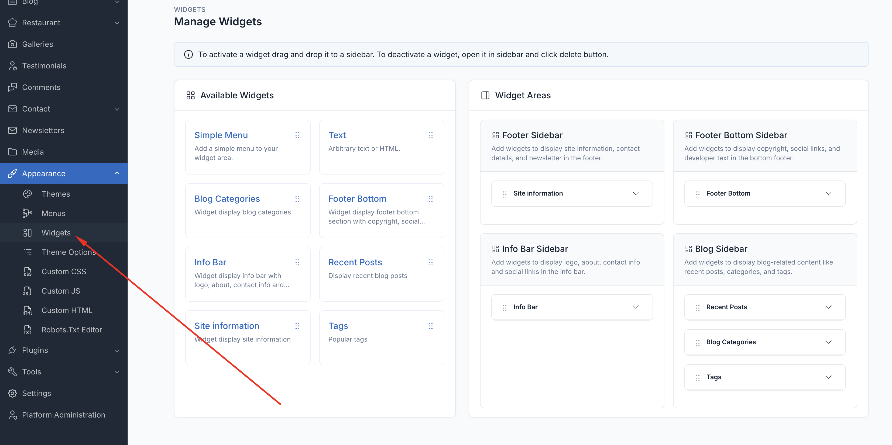
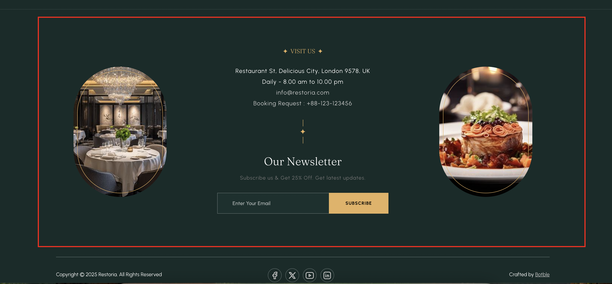
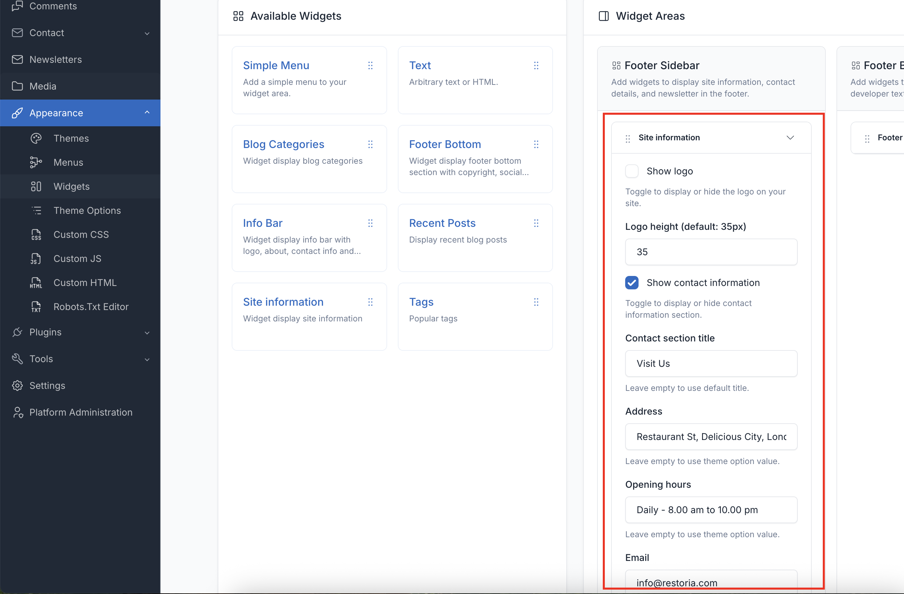
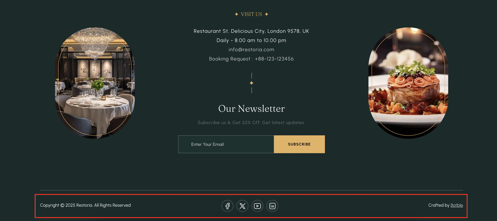
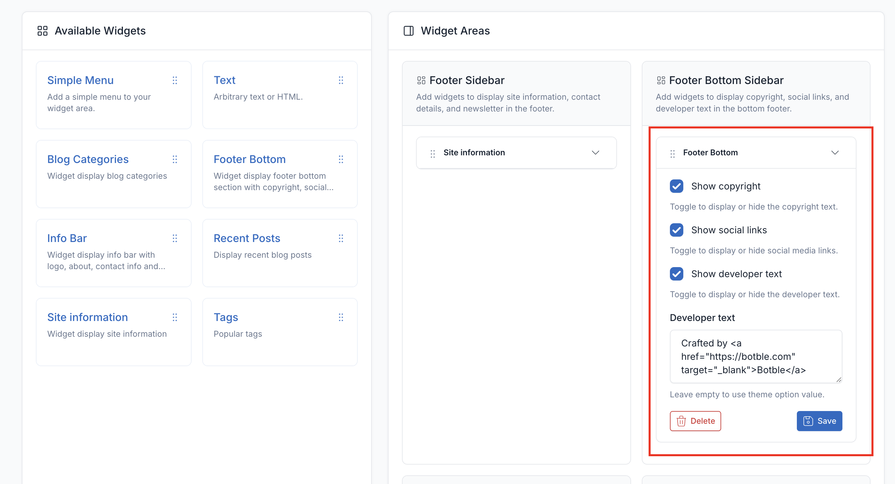
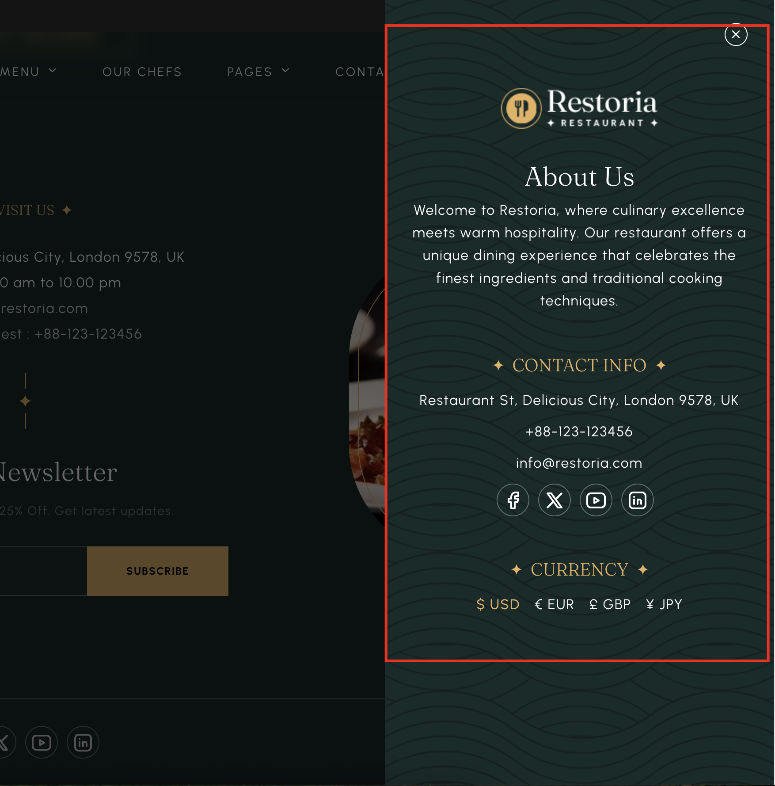
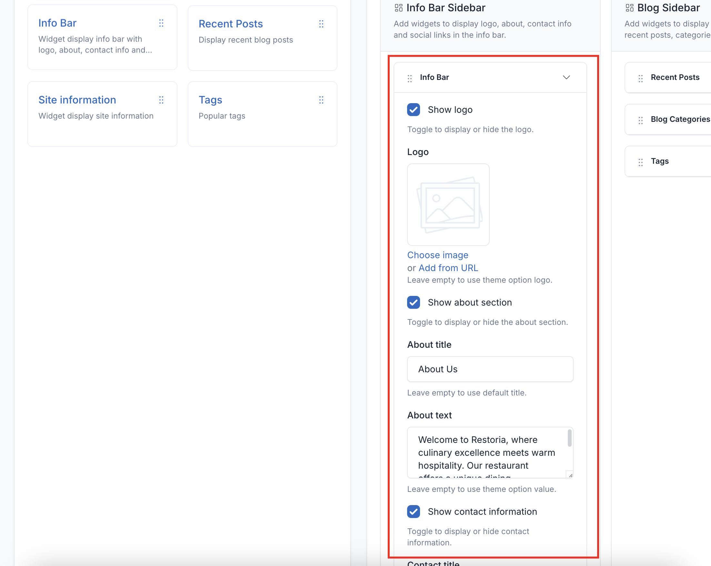
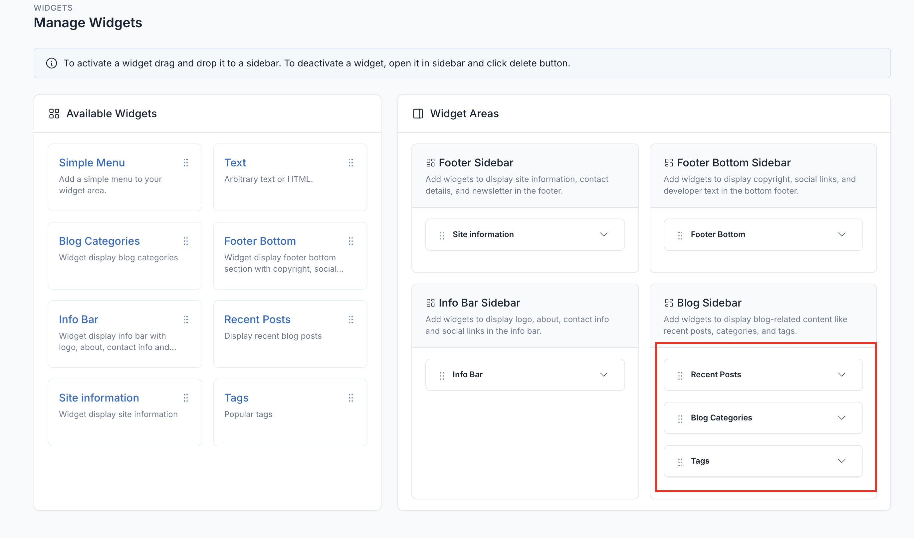
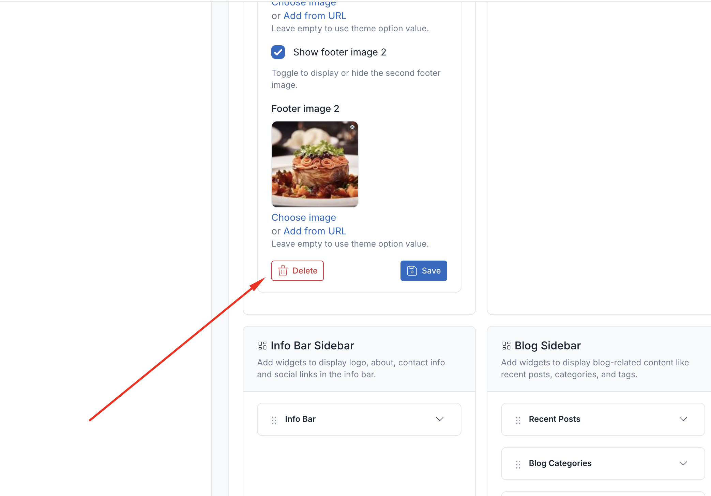

# Widgets

Widgets are modular content blocks that can be placed in various widget areas throughout your Velura spa & beauty website. They provide dynamic functionality without requiring coding knowledge.

## Managing Widgets

Access widget management from **Appearance** → **Widgets** in your admin panel.

To add a widget to a sidebar, drag and drop the widget from the left side to the sidebar area on the right side.

## Widget Areas

### 1. Footer Sidebar

Displayed in the main footer area. Add widgets here to show site information, contact details, and a newsletter signup.

### 2. Footer Bottom Sidebar

Displayed in the bottom bar of the footer. Add widgets here to show copyright text, social links, and developer/credit text.

### 3. Info Bar Sidebar

Displayed in the info bar. Add widgets here to show the logo, a short about text, contact information, and social links.

### 4. Blog Sidebar

Displayed alongside blog posts and archives. Add widgets here to show recent posts, categories, and tags.

## Delete Widgets

If you don't want to use the widgets in some areas, you can remove them by collapsing the widget and clicking the
**Delete** button.

