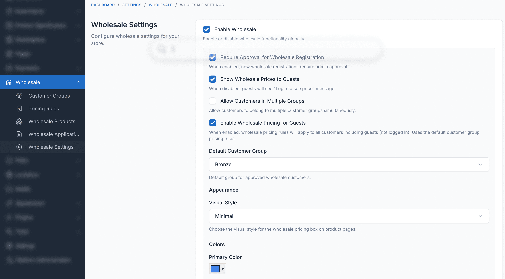

# Installation

## Requirements

Before installing Wholesale, ensure your system meets the following requirements:

- Botble CMS version 7.6.0 or higher
- PHP version 8.2 or higher
- Active E-commerce plugin (required dependency)
- MySQL 5.7+ or MariaDB 10.3+

## Installation Steps

### Step 1: Download the Plugin

Download the Wholesale plugin from [CodeCanyon](https://codecanyon.net/user/botble/portfolio) after purchase.

### Step 2: Extract the Files

Extract the downloaded zip file to your computer. You will find a folder named `ecommerce-wholesale`.

### Step 3: Upload to Server

Upload the extracted `ecommerce-wholesale` folder to your Botble CMS installation:

```
platform/plugins/ecommerce-wholesale
```

Your directory structure should look like:

```
platform/
└── plugins/
    └── ecommerce-wholesale/
        ├── config/
        ├── database/
        ├── resources/
        ├── routes/
        ├── src/
        └── plugin.json
```

### Step 4: Activate the Plugin

1. Log in to your Botble CMS admin panel
2. Navigate to **Plugins** in the sidebar
3. Find **Wholesale** in the plugins list
4. Click the **Activate** button


### Step 5: Configure Settings (Optional)

After activation, you can configure the plugin settings:

1. Navigate to **Settings** in the sidebar
2. Click on **Wholesale** under Ecommerce settings
3. Customize approval requirements, pricing display, and behavior



## Verification

To verify the installation was successful:

1. Navigate to **Ecommerce > Wholesale** in the admin panel
2. You should see the Customer Groups management page
3. Try creating a new customer group to confirm everything works

## Troubleshooting

### Plugin not appearing in the list

- Ensure the folder is named exactly `ecommerce-wholesale`
- Check that all files were uploaded correctly
- Clear the cache: **Settings > General > Clear Cache**

### Dependency error

- Make sure the E-commerce plugin is installed and activated
- Wholesale requires the E-commerce plugin to function

### Database migration issues

- Run migrations manually via command line:
  ```bash
  php artisan migrate
  ```
- Or use the admin panel: **Plugins > Wholesale > Deactivate > Activate**

## Next Steps

After successful installation:

1. [Create your first customer group](./usage/customer-groups.md)
2. [Configure pricing rules](./usage/pricing-rules.md)
3. [Set up wholesale registration](./configuration.md#registration-settings)
