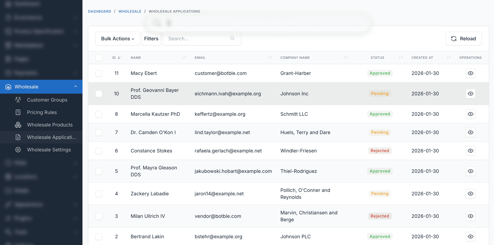
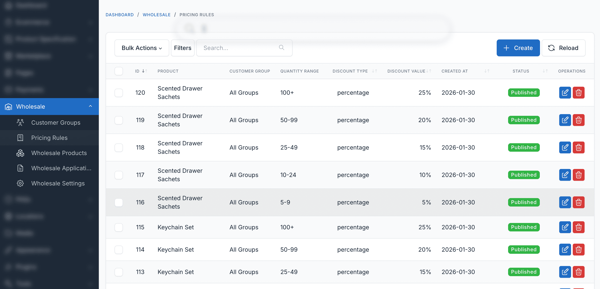

# Admin Dashboard

This guide covers the administrative interface for managing wholesale operations in your Botble e-commerce store.

## Accessing the Wholesale Admin

Navigate to **Ecommerce** > **Wholesale** in the admin sidebar to access wholesale management.

## Main Menu Options

| Menu Item | Description |
|-----------|-------------|
| **Customer Groups** | Manage wholesale customer groups and discounts |
| **Pricing Rules** | Create quantity-based tiered pricing |
| **Applications** | Review and approve wholesale account requests |
| **MOQ Settings** | Configure minimum order quantities per product |
| **Settings** | Configure system-wide wholesale settings |

## Customer Groups Management

### Customer Groups List

View and manage all customer groups:

**List Features:**
- **Search** - Find groups by name
- **Filter** - By status (Published/Draft)
- **Sort** - By name, priority, or date
- **Bulk Actions** - Delete or change status of multiple groups

**Group Information Displayed:**
- Group name
- Discount type and value
- Priority level
- Status badge
- Number of assigned customers
- Action buttons (Edit, Delete)

### Creating Customer Groups

Click **Create** to add a new group:

**Required Information:**
- Group name (e.g., "Gold Resellers")
- Discount type (Percentage or Fixed)
- Discount value
- Status (Published or Draft)

**Optional Settings:**
- Description (internal notes)
- Priority (for conflict resolution)
- Minimum order quantity
- Minimum order value

See [Customer Groups Guide](/wholesale/usage/customer-groups) for detailed instructions.

### Editing Customer Groups

1. Click **Edit** button on any group
2. Make changes to settings
3. Click **Save**

::: warning
Changes to discount values take effect immediately for all customers in that group.
:::

## Pricing Rules Management

### Pricing Rules List

View and manage all pricing rules:

**List Features:**
- **Search** - Find rules by product name
- **Filter** - By customer group, status
- **Sort** - By product, group, or date
- **Bulk Actions** - Delete multiple rules

**Rule Information Displayed:**
- Product name with image
- Customer group
- Quantity range (e.g., "50-99", "100+")
- Discount type and value
- Final price preview
- Status badge
- Action buttons

### Creating Pricing Rules

Click **Create** to add a new rule:

**Required Information:**
1. Select product
2. Select customer group
3. Define quantity tier (min and max)
4. Choose discount type
5. Enter discount value
6. Set status

See [Pricing Rules Guide](/wholesale/usage/pricing-rules) for detailed instructions.

### Managing Multiple Rules

**For Single Product:**
- Create multiple rules for different quantity ranges
- Create separate rules for different customer groups
- Each group can have different tier structures

**Viewing Product Rules:**
- Filter by product name
- See all tiers at once
- Verify no gaps in quantity ranges

## Applications Management

### Applications List

Review wholesale account applications:

**List Features:**
- **Filter** - By status (Pending, Approved, Rejected)
- **Search** - By company name or customer name
- **Sort** - By date submitted
- **Quick Actions** - Approve or reject

**Application Information:**
- Company name
- Applicant name and email
- Application date
- Status badge
- Business details summary
- Action buttons

### Reviewing Applications

#### Viewing Application Details

Click on an application to see full details:

**Customer Information:**
- Full name
- Email address
- Phone number
- Existing account status

**Business Information:**
- Company name
- Tax ID/Business number
- Business address
- Business type
- Website URL
- Additional notes

#### Approving Applications

1. Click **Approve** button
2. Select customer group to assign
3. Optionally set expiration date
4. Add approval notes (optional)
5. Click **Confirm**

**What Happens:**
- Customer account assigned to selected group
- Customer receives approval email
- Can immediately log in and see wholesale prices
- Application status changes to "Approved"

#### Rejecting Applications

1. Click **Reject** button
2. Optionally add rejection reason
3. Click **Confirm**

**What Happens:**
- Customer receives rejection email
- Application status changes to "Rejected"
- Customer can reapply after addressing issues

#### Pending Applications

Applications remain pending until admin reviews them. Configure automatic approval in settings if you want to skip manual review.

## Customer Management

### Viewing Customer's Wholesale Status

From **Customers** list:

1. Edit any customer
2. Scroll to "Wholesale Information" section

**Wholesale Information Shows:**
- Assigned customer groups
- Assignment dates
- Expiration dates
- Wholesale status (Active/Expired)

### Manual Customer Assignment

To manually assign a customer to a group:

1. Edit customer account
2. Find "Customer Groups" field
3. Select one or more groups
4. Optionally set expiration date
5. Save customer

**Use Cases:**
- VIP customers
- Special agreements
- Migrating existing customers
- Temporary access

### Removing Wholesale Access

To remove wholesale access:

1. Edit customer account
2. Remove all group assignments
3. Save customer

Customer reverts to retail pricing immediately.

## Product Management

### Setting Product MOQ

In product edit page:

1. Open any product for editing
2. Go to "Wholesale Settings" tab
3. Configure MOQ settings:

**MOQ Fields:**
- Customer group (or All Wholesale)
- Minimum quantity
- Quantity increment
- Status (Active/Inactive)

**Example:**
- Min Quantity: 24
- Increment: 12
- Valid orders: 24, 36, 48, 60...

### Setting Product Visibility

In product edit page, "Wholesale Settings" tab:

**Visibility Options:**
- **Public** - Everyone can see
- **Wholesale Only** - Only wholesale customers
- **Hidden** - Direct link only

**Product Group Access:**
- Leave empty = all wholesale customers
- Select groups = only those groups can see
- Only applies if visibility is "Wholesale Only"

### Bulk Product Updates

For updating many products at once:

1. Export products
2. Update wholesale settings in spreadsheet
3. Import products back
4. Or use database queries

## Reports & Analytics

### Wholesale Sales Overview

View wholesale performance:

**Available Metrics:**
- Total wholesale orders
- Wholesale revenue
- Average order value by group
- Top wholesale customers
- Most purchased products
- Discount amounts given

### Customer Group Performance

Analyze which groups are most profitable:

**Metrics per Group:**
- Number of customers
- Total orders
- Average order value
- Total revenue
- Average discount given
- Customer lifetime value

### Pricing Rule Effectiveness

Track which pricing tiers are used most:

**Metrics per Rule:**
- Number of times used
- Quantities purchased at each tier
- Revenue generated
- Average discount at each tier

## Settings Management

Access via **Settings** > **Ecommerce** > **Wholesale**:

### General Settings

| Setting | Description |
|---------|-------------|
| **Enable Wholesale** | Turn system on/off |
| **Require Approval** | Manual or automatic approval |
| **Show Prices to Guests** | Price visibility for non-logged-in users |
| **Allow Multiple Groups** | Can customer be in multiple groups |
| **Discount Resolution** | How to handle multiple group conflicts |

### Display Settings

| Setting | Description |
|---------|-------------|
| **Visual Style** | Modern, Minimal, Classic, Elegant |
| **Display Mode** | Full or Compact |
| **Show Savings** | Display savings amounts |
| **Section Title** | Custom title for pricing tables |

### Email Notifications

Configure email templates:

- Application received confirmation
- Admin new application notification
- Application approved
- Application rejected
- Group assignment notification
- Expiration warning

## Permissions Management

### Available Permissions

Assign to user roles in **Users** > **Roles**:

**Customer Groups:**
- `wholesale.customer-groups.index` - View groups
- `wholesale.customer-groups.create` - Create groups
- `wholesale.customer-groups.edit` - Edit groups
- `wholesale.customer-groups.destroy` - Delete groups

**Pricing Rules:**
- `wholesale.pricing-rules.index` - View rules
- `wholesale.pricing-rules.create` - Create rules
- `wholesale.pricing-rules.edit` - Edit rules
- `wholesale.pricing-rules.destroy` - Delete rules

**Applications:**
- `wholesale.applications.index` - View applications
- `wholesale.applications.approve` - Approve/reject
- `wholesale.applications.view` - View details

**Settings:**
- `wholesale.settings` - Access settings page

### Recommended Permission Sets

**Store Manager (Full Access):**
- All wholesale permissions

**Sales Manager (Limited):**
- View groups and rules
- View and approve applications
- Cannot modify settings

**Customer Service (View Only):**
- View groups
- View customer assignments
- Cannot approve applications

## Workflow Best Practices

### Daily Tasks

1. **Review New Applications**
   - Check for new submissions
   - Verify business information
   - Approve or request more info
   - Respond within 24-48 hours

2. **Monitor Orders**
   - Review wholesale orders
   - Check for MOQ issues
   - Verify pricing applied correctly
   - Address customer questions

### Weekly Tasks

1. **Performance Review**
   - Check sales by group
   - Review top customers
   - Analyze pricing tier usage
   - Identify trends

2. **Customer Management**
   - Check for expired assignments
   - Review inactive customers
   - Send re-engagement emails
   - Update group assignments

### Monthly Tasks

1. **Strategy Review**
   - Analyze group performance
   - Adjust discount levels if needed
   - Review pricing rule effectiveness
   - Update MOQ settings

2. **Cleanup**
   - Archive old applications
   - Remove inactive rules
   - Update customer groups
   - Optimize settings

### Quarterly Tasks

1. **Deep Analysis**
   - Compare to retail performance
   - Calculate profitability by group
   - Review customer lifecycle
   - Plan strategic changes

2. **System Maintenance**
   - Update documentation
   - Train new staff
   - Review permissions
   - Test all features

## Troubleshooting Admin Issues

### Can't access wholesale menu

1. Check user role permissions
2. Verify plugin is activated
3. Clear cache
4. Check admin prefix in URL

### Changes not saving

1. Check file permissions
2. Verify database connection
3. Clear config cache
4. Check error logs

### Applications not appearing

1. Check email configuration
2. Verify application form works
3. Check database for records
4. Review permissions

### Bulk actions not working

1. Check selected items
2. Verify permissions
3. Clear cache
4. Check for JavaScript errors

## Related Documentation

- [Customer Groups](/wholesale/usage/customer-groups) - Detailed group management
- [Pricing Rules](/wholesale/usage/pricing-rules) - Advanced pricing setup
- [Configuration](/wholesale/configuration) - System settings
- [Troubleshooting](/wholesale/troubleshooting) - Fix common issues
