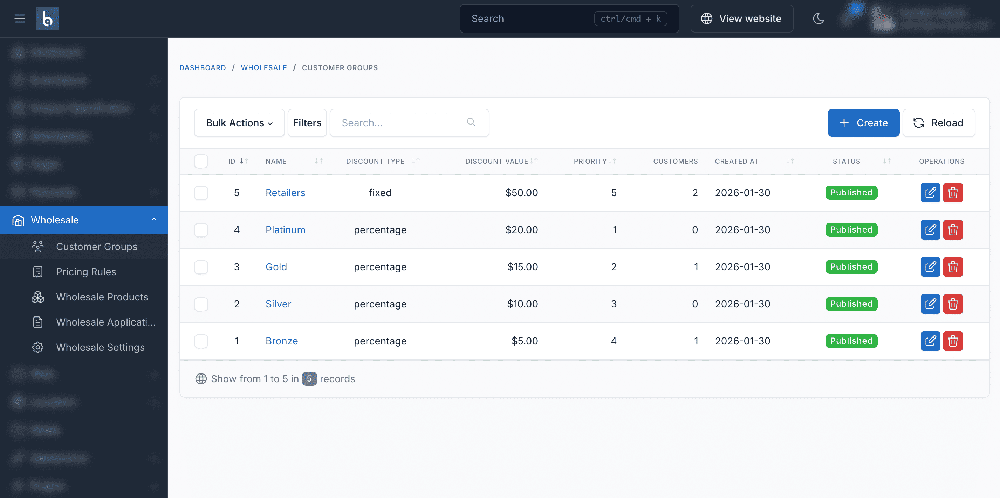

# Customer Groups

Customer groups are the foundation of the wholesale system. They define which customers get special pricing, what discounts they receive, and any minimum order requirements.

## Understanding Customer Groups

A customer group is a collection of customers who receive the same wholesale pricing and have the same order requirements. Common examples:

- **VIP Wholesalers** - Top-tier customers, highest discounts
- **Distributors** - Mid-level partners
- **Resellers** - Entry-level wholesale customers
- **Corporate Accounts** - B2B customers with negotiated rates

## Creating a Customer Group

### Step 1: Navigate to Customer Groups

1. Log in to admin panel
2. Go to **Ecommerce** > **Wholesale** > **Customer Groups**
3. Click the **Create** button

### Step 2: Configure Basic Information

| Field | Description | Example |
|-------|-------------|---------|
| **Name** | Descriptive group name | "Gold Resellers" |
| **Description** | Internal notes about this group | "Verified resellers with annual volume >$50K" |
| **Status** | Published (active) or Draft (inactive) | Published |

::: tip Naming Convention
Use clear, descriptive names that indicate the discount level or customer type. For example: "Platinum - 25% Off" or "Distributor - Tier 1"
:::

### Step 3: Set Priority

**Priority** determines which group's settings take precedence when a customer belongs to multiple groups.

| Priority | Typical Use |
|----------|-------------|
| 100 | Platinum/VIP customers |
| 75 | Gold/Premium customers |
| 50 | Silver/Standard customers |
| 25 | Bronze/Entry customers |

Higher numbers = higher priority

::: warning Important
Priority is only used when "Discount Resolution Strategy" is set to "Priority" in settings. Otherwise, the system uses "Highest" or "Lowest" discount strategy.
:::

### Step 4: Configure Discount Settings

#### Discount Type

Choose how discounts are calculated:

**Percentage Discount**
- Reduces product price by a percentage
- Example: 20% off a $100 product = $80
- Best for: Standard wholesale pricing

**Fixed Amount Discount**
- Reduces product price by a fixed dollar amount
- Example: $15 off a $100 product = $85
- Best for: Promotions, special pricing

#### Discount Value

Enter the amount or percentage:
- For Percentage: Enter 20 (for 20%)
- For Fixed Amount: Enter 15.00 (for $15 off)

**Example Configurations:**

| Group | Type | Value | $100 Product | $50 Product |
|-------|------|-------|--------------|-------------|
| Platinum | Percentage | 25 | $75 | $37.50 |
| Gold | Percentage | 20 | $80 | $40.00 |
| Silver | Percentage | 15 | $85 | $42.50 |
| Bronze | Fixed | 10 | $90 | $40.00 |

### Step 5: Set Order Requirements

#### Minimum Order Quantity

The minimum number of items a customer must order across all products in cart.

**Use Cases:**
- Ensure profitable orders: Min 50 items
- Cover shipping costs: Min 100 items
- Match packaging: Min 24 items (2 cases)

Leave at 0 for no minimum.

#### Minimum Order Value

The minimum cart subtotal required to place an order.

**Use Cases:**
- Ensure order profitability: Min $500
- Cover shipping/handling: Min $250
- Tiered minimums: $100 (Bronze), $500 (Silver), $1000 (Gold)

Leave at 0 for no minimum.

::: tip Business Strategy
Set minimums that ensure profitability while remaining competitive. Consider your:
- Average order processing costs
- Shipping costs
- Profit margins
- Industry standards
:::

### Step 6: Save the Group

Click **Save** to create the customer group.

## Managing Customer Groups

### Editing Groups

1. Go to **Ecommerce** > **Wholesale** > **Customer Groups**
2. Find the group in the list
3. Click the **Edit** button
4. Make changes
5. Click **Save**

::: warning Price Changes
Changes to discount values take effect immediately for all customers in that group. Existing cart prices will update on next page load.
:::

### Duplicating Groups

To create similar groups quickly:

1. Edit an existing group
2. Change the name
3. Adjust discount values
4. Save as new group

### Deleting Groups

::: danger Warning
Deleting a group removes all customer assignments. Customers will lose wholesale pricing.
:::

1. Go to customer groups list
2. Click **Delete** button
3. Confirm deletion

**Before deleting:**
- Reassign customers to different group
- Or accept that they'll become regular retail customers

### Activating/Deactivating Groups

Instead of deleting, you can deactivate groups:

1. Edit the group
2. Change Status to **Draft**
3. Save

Deactivated groups:
- Customers keep their assignments
- But group pricing doesn't apply
- Easy to reactivate later

## Assigning Customers to Groups

### Manual Assignment

1. Go to **Customers** in admin
2. Find and edit a customer
3. Scroll to "Wholesale Information" section
4. Select customer group(s)
5. Optionally set expiration date
6. Save customer

### Assignment via Applications

When approving wholesale applications:

1. Go to **Ecommerce** > **Wholesale** > **Applications**
2. Click **Approve** on an application
3. Select appropriate customer group
4. System creates customer and assigns group
5. Customer receives approval email

### Bulk Assignment

For assigning multiple customers at once, use database queries or contact support for assistance.

## Customer Group Strategies

### Strategy 1: Tiered Discount Structure

Create groups based on discount levels:

| Group | Discount | Min Order | Target Customers |
|-------|----------|-----------|------------------|
| Platinum | 25% | $2000 | Top 10% customers |
| Gold | 20% | $1000 | High-volume buyers |
| Silver | 15% | $500 | Regular wholesale |
| Bronze | 10% | $250 | Entry-level wholesale |

### Strategy 2: Customer Type Based

Create groups based on business type:

| Group | Discount | Min Order | Customer Type |
|-------|----------|-----------|---------------|
| Distributors | 30% | $5000 | Regional distributors |
| Retailers | 20% | $1000 | Retail store owners |
| Resellers | 15% | $500 | Online resellers |
| Corporate | 10% | $500 | B2B corporate accounts |

### Strategy 3: Volume Commitments

Create groups based on purchase commitments:

| Group | Discount | Min Order | Annual Commitment |
|-------|----------|-----------|-------------------|
| Elite | 30% | $2000 | $100,000+ |
| Pro | 25% | $1500 | $50,000+ |
| Standard | 20% | $1000 | $25,000+ |
| Starter | 15% | $500 | $10,000+ |

### Strategy 4: Hybrid Approach

Combine strategies:

| Group | Discount | Min Order | Criteria |
|-------|----------|-----------|----------|
| Diamond Distributor | 35% | $5000 | Distributors with $100K+ annual |
| Gold Distributor | 30% | $3000 | Distributors with $50K+ annual |
| Preferred Retailer | 25% | $1500 | Retailers with $25K+ annual |
| Standard Retailer | 20% | $1000 | Verified retail businesses |
| Reseller | 15% | $500 | Approved resellers |

## Advanced Group Features

### Group Expiration

Set expiration dates on customer assignments:

**Use Cases:**
- Trial periods: 30-day trial in Gold group
- Seasonal promotions: Holiday pricing group
- Temporary upgrades: Reward high-volume months
- Contract periods: Annual agreements

When expired:
- Customer reverts to retail pricing
- Or assign to lower-tier group automatically

### Multiple Group Membership

If "Allow Multiple Customer Groups" is enabled:

**Benefits:**
- Flexible pricing options
- Promotional groups + base groups
- Regional + tier-based groups

**Conflict Resolution:**
- Highest discount (default)
- Lowest discount
- Priority-based

**Example:**
- Customer in "Gold" (20% off) and "Holiday Promo" (25% off)
- With "Highest" strategy, they get 25% off
- With "Priority" strategy, higher priority group wins

### Group-Specific Product Access

Combine groups with product restrictions:

1. Set product visibility to "Wholesale Only"
2. In product edit, select allowed groups
3. Only those groups can see/purchase

**Use Case:**
- Exclusive products for top-tier groups
- Clearance items for specific groups
- Pre-release products for VIP customers

## Best Practices

### 1. Start Simple

Begin with 2-3 basic groups:
- Entry-level wholesale (10-15% off)
- Standard wholesale (15-20% off)
- Premium wholesale (20-25% off)

Add complexity as you learn what works.

### 2. Clear Qualification Criteria

Document requirements for each group:
- What business verification is needed?
- What sales volume qualifies?
- What order history is required?

### 3. Regular Review

- Quarterly: Review customer performance
- Annually: Reassess group structure
- Monitor: Which groups are most profitable
- Adjust: Discounts and minimums based on data

### 4. Communication

- Explain groups to customers
- Show qualification paths
- Highlight benefits of upgrading
- Send notifications when assigned

### 5. Competitive Analysis

- Research competitor pricing
- Understand industry standards
- Position groups strategically
- Maintain healthy margins

## Troubleshooting

### Customers not seeing discounted prices

1. Verify customer is assigned to group
2. Check group status is "Published"
3. Ensure customer is logged in
4. Clear all caches
5. Check expiration date on assignment

### Wrong discount applying

1. Check if customer in multiple groups
2. Review discount resolution strategy
3. Verify group priorities
4. Look for pricing rules that override

### Can't assign customer to group

1. Verify customer account exists
2. Check admin permissions
3. Ensure group is not deleted
4. Try clearing cache

### Group changes not taking effect

1. Clear server cache
2. Clear browser cache
3. Log out and log back in
4. Check for pricing rules that override

## Related Documentation

- [Pricing Rules](/wholesale/usage/pricing-rules) - Create tiered quantity pricing
- [Admin Dashboard](/wholesale/usage/admin-dashboard) - Manage all wholesale features
- [Configuration](/wholesale/configuration) - System-wide wholesale settings
