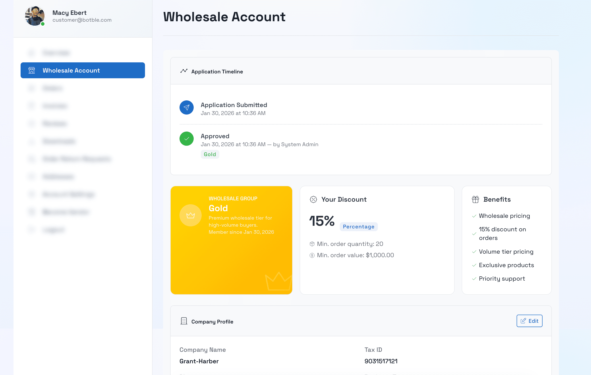
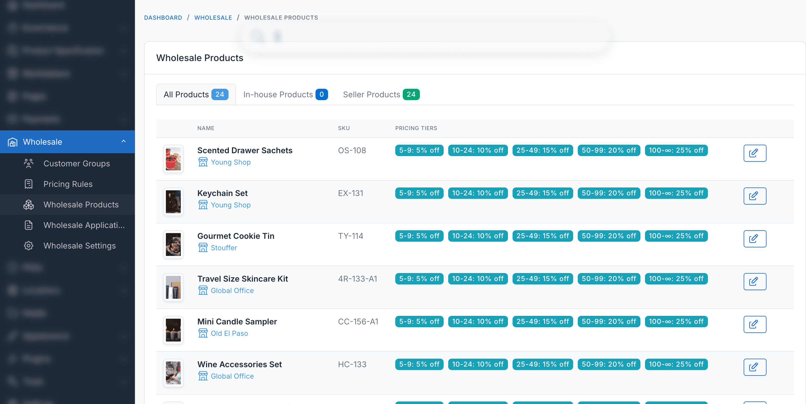

# Customer Guide

This guide is for your wholesale customers - people who buy from your store at wholesale prices. You can link to this page from your store's footer or help center.

## Applying for a Wholesale Account

### Step 1: Visit the registration page

Go to `/wholesale/register` on the store website. You may also find a link in the site footer or customer dashboard.

### Step 2: Fill out the form

If you don't have an account yet, you'll see fields for:

| Field | Required | Notes |
|-------|----------|-------|
| **Full Name** | Yes | Your name |
| **Email** | Yes | This will be your login email |

All applicants fill in:

| Field | Required | Notes |
|-------|----------|-------|
| **Company Name** | Yes | Your business name |
| **Tax ID** | No | Your business tax identification number |
| **Phone** | No | Contact number |
| **Business Type** | No | e.g., "Retailer", "Distributor", "Reseller" |
| **Expected Order Volume** | No | e.g., "$5,000 - $10,000 per month" |
| **Additional Notes** | No | Tell the store about your business |

### Step 3: Submit and wait

After submitting:
- You'll see a confirmation message
- The store admin reviews your application
- You'll be notified when approved or rejected

**Processing time** depends on the store. Some stores auto-approve applications instantly.

## After Approval

### Logging in

1. Go to the store website
2. Click **Login** or **My Account**
3. Enter your email and password
4. You're now logged in as a wholesale customer

### What changes when you're a wholesale customer

**Product prices** - You'll see lower prices on product pages and in product listings. Some stores show both the original price (crossed out) and your wholesale price.

**Pricing table** - Some products show a table with quantity-based discounts:

For example:

| Quantity | Price per unit | You save |
|----------|---------------|----------|
| 1-49 | $80 | 20% |
| 50-99 | $75 | 25% |
| 100+ | $70 | 30% |

**Wholesale-only products** - You may see products that retail customers can't see. These are exclusive to wholesale accounts.

**Minimum quantities** - Some products require a minimum order quantity. If you try to add fewer than the minimum, the quantity will be adjusted automatically.

### Checking your wholesale status

1. Log in to your account
2. Go to your customer dashboard
3. Look for the **Wholesale Account** section at `/customer/wholesale/`

This page shows:
- Your application status (Pending, Approved, or Rejected)
- Your assigned customer group and discount level
- Your company details

### Updating your company information

1. Go to `/customer/wholesale/profile/edit` (or find it in your dashboard)
2. Update your company details
3. Click **Save**

## Shopping as a Wholesale Customer

### Adding products to cart

1. Browse products as usual
2. If a product has a minimum order quantity, you must meet it
3. If a product has quantity increments (e.g., multiples of 12), the quantity will snap to the nearest valid amount
4. Add to cart - your wholesale price is applied automatically

### Viewing your savings

In the cart, you'll see wholesale prices applied to each item. Some stores show the savings amount next to each item.

### Checking out

Checkout works the same as a regular purchase. Your wholesale prices are locked in at checkout.

### Meeting order minimums

Your customer group may have minimum order requirements:

- **Minimum order quantity** - Total items in cart must meet this number
- **Minimum order value** - Cart subtotal must meet this amount

If you don't meet the minimums, you'll see a message at checkout explaining what's needed.

## Reapplying After Rejection

If your application was rejected:

1. Go to `/customer/wholesale/reapply` (or find it in your wholesale dashboard)
2. The rejection reason is shown so you know what to address
3. Fill out the reapplication form with updated information
4. Submit

::: tip
You can reapply once per day.
:::

## Common Questions

### I'm logged in but don't see wholesale prices

- Your application may still be pending. Check your status at `/customer/wholesale/`
- If approved, try clearing your browser cache and logging in again
- Contact the store if the issue persists

### I can't order less than a certain quantity

Some products have minimum order quantities set by the store. The minimum is shown on the product page. You must order at least that many.

### How do I get a bigger discount?

Contact the store to ask about upgrading to a higher customer group. Many stores offer better discounts for larger order commitments.

### I can't see certain products

Some products are restricted to specific customer groups. If you believe you should have access, contact the store.

## Getting Support

Contact the store directly for help with:
- Your wholesale account status
- Pricing questions
- Order issues
- Group upgrades
