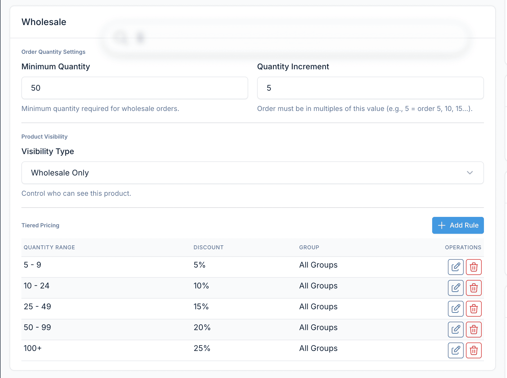
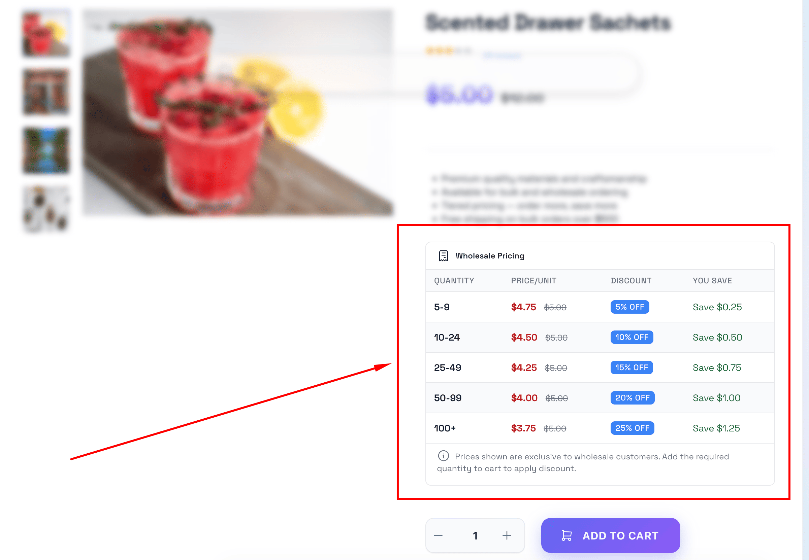

# Pricing Rules

Pricing rules let you set quantity-based tiered pricing on individual products. Unlike [customer group discounts](/wholesale/usage/customer-groups) (which apply a flat discount to all products), pricing rules give bigger discounts when customers buy more of a specific product.

## How Pricing Rules Work

A pricing rule says: "For this product, when a customer orders X-Y units, apply this discount."

**Example** - Product: Widget, retail price $100

| Quantity | Discount | Price per unit |
|----------|----------|---------------|
| 1-49 | No rule (group discount applies) | $80 (if group = 20% off) |
| 50-99 | 25% off | $75 |
| 100-249 | 30% off | $70 |
| 250+ | 35% off | $65 |

When a Gold customer (20% group discount) orders 150 widgets, they pay $70 each because the 100-249 tier gives a better deal than the 20% group discount.

## Two Ways to Create Pricing Rules

### Option A: From the product edit page (recommended)

This is the easiest way because you can set up all tiers for a product in one place.

1. Go to **Ecommerce > Products** and edit a product
2. Scroll down to the **Wholesale** section
3. In the **Tiered Pricing Rules** area, click **Add Rule**
4. A dialog appears with these fields:

| Field | Required | What to enter |
|-------|----------|---------------|
| **Min Quantity** | Yes | Starting quantity for this tier, e.g., `50` |
| **Max Quantity** | No | Ending quantity, e.g., `99`. Leave empty for "and above" |
| **Discount Type** | Yes | Percentage, Fixed Amount, or Fixed Price |
| **Discount Value** | Yes | The discount number (see below) |
| **Customer Group** | No | Apply to a specific group, or leave as "All Groups" for all wholesale customers |

5. Click **Save** in the dialog
6. Repeat for each tier
7. Click **Save** on the product

### Option B: From the Pricing Rules page

1. Go to **Wholesale > Pricing Rules**
2. Click **Create**
3. Fill in the form:

| Field | Required | What to enter |
|-------|----------|---------------|
| **Product** | Yes | Search and select the product |
| **Customer Group** | No | Select a specific group, or leave empty for all wholesale customers |
| **Min Quantity** | Yes | Starting quantity, e.g., `50` |
| **Max Quantity** | No | Ending quantity. Leave empty for unlimited |
| **Discount Type** | Yes | Percentage, Fixed Amount, or Fixed Price |
| **Discount Value** | Yes | The discount number |
| **Status** | Yes | Published to activate, Draft to save without activating |

4. Click **Save**

## Discount Types

### Percentage

Reduces the price by a percentage off the retail price.

**Value:** Enter the percentage number (e.g., `15` for 15% off)

Example: 15% off a $100 product = **$85**

### Fixed Amount

Reduces the price by a flat dollar amount.

**Value:** Enter the dollar amount (e.g., `20` for $20 off)

Example: $20 off a $100 product = **$80**

### Fixed Price

Sets an absolute price, ignoring the retail price entirely.

**Value:** Enter the final price (e.g., `75` for $75)

Example: Fixed price $75, regardless of whether retail is $100 or $120 = **$75**

::: tip When to use each type
- **Percentage** - Most common. Scales automatically when you change product prices.
- **Fixed Amount** - Good for simple promotions ("$10 off when you buy 50+").
- **Fixed Price** - Best for contract pricing or when you want exact control over the wholesale price.
:::

## Setting Up Tiers: A Complete Example

Let's set up tiered pricing for a product called "Premium Widget" that retails for $50.

**Goal:** Encourage bulk orders with progressive discounts.

### Step 1: Plan your tiers

| Tier | Quantity | Price per unit | Discount type | Value |
|------|----------|---------------|---------------|-------|
| Small bulk | 10-49 | $45 | Percentage | 10 |
| Medium bulk | 50-99 | $42.50 | Percentage | 15 |
| Large bulk | 100+ | $40 | Percentage | 20 |

### Step 2: Create the rules

1. Go to **Ecommerce > Products**, edit "Premium Widget"
2. Scroll to **Wholesale** section
3. Click **Add Rule**, enter: Min Qty = `10`, Max Qty = `49`, Type = Percentage, Value = `10`, Group = All Groups. Save.
4. Click **Add Rule**, enter: Min Qty = `50`, Max Qty = `99`, Type = Percentage, Value = `15`, Group = All Groups. Save.
5. Click **Add Rule**, enter: Min Qty = `100`, Max Qty = empty, Type = Percentage, Value = `20`, Group = All Groups. Save.
6. Click **Save** on the product.

### Step 3: Verify on the frontend

Log in as a wholesale customer and visit the product page. You should see a pricing table like:

::: warning
The pricing table only shows on the frontend if **Show Pricing Table** is enabled in [Wholesale Settings](/wholesale/configuration#show-pricing-table).
:::

## Group-Specific Pricing Rules

You can create different pricing tiers for different customer groups on the same product.

**Example:** Premium Widget ($50 retail)

**For Gold customers:**

| Quantity | Price | Rule |
|----------|-------|------|
| 10-49 | $40 | 20% off |
| 50+ | $37.50 | 25% off |

**For Silver customers:**

| Quantity | Price | Rule |
|----------|-------|------|
| 25-99 | $42.50 | 15% off |
| 100+ | $40 | 20% off |

To set this up, create separate rules for each group - select the specific group in the **Customer Group** field when creating each rule.

## Managing Pricing Rules

### Viewing all rules

Go to **Wholesale > Pricing Rules** to see all rules across all products. You can:
- **Search** by product name
- **Filter** by customer group or status
- **Sort** by product, group, or date

### Editing a rule

1. Go to **Wholesale > Pricing Rules** and click **Edit** on the rule, or
2. Edit the product and modify the rule in the **Wholesale** section

### Deleting a rule

Delete from the pricing rules list, or remove it from the product edit page. The product reverts to the group discount (or retail price if no group) for that quantity range.

## How Pricing Rules Interact with Group Discounts

When a customer has both a group discount and a pricing rule applies, the system picks the price that gives the customer the **better deal**.

**Example:**
- Customer is in Gold group (20% off all products)
- Product has a pricing rule: 50-99 units at 15% off

For an order of 75 units:
- Group discount: 20% off = $80 per unit
- Pricing rule: 15% off = $85 per unit
- **Result:** Customer gets $80 (group discount wins because it's cheaper)

For an order of 100 units (with a rule of 25% off at 100+):
- Group discount: 20% off = $80 per unit
- Pricing rule: 25% off = $75 per unit
- **Result:** Customer gets $75 (pricing rule wins)

## Important Rules

### No overlapping quantity ranges

Don't create two rules for the same product and group with overlapping quantities. For example, don't create both "10-100 at 10% off" and "50-200 at 15% off".

### Leave no gaps (optional)

If you want every quantity to have a tier, make sure ranges are contiguous:
- 10-49, 50-99, 100+ (good - no gaps)
- 10-49, 100+ (gap at 50-99 - quantities 50-99 will use the group discount instead)

### Max quantity empty = unlimited

Leave the **Max Quantity** field empty to mean "and above". The rule "Min: 100, Max: empty" means "100 or more units."

## Troubleshooting

### Pricing table not showing on product page

1. Check **Show Pricing Table** is enabled: **Wholesale > Settings > Display Options > Show Pricing Table**
2. Check the product has at least one pricing rule with status **Published**
3. Check you're logged in as a wholesale customer (or guest viewing is enabled)
4. Clear cache: **Admin > Platform Administration > Cache management**

### Wrong price in cart

1. Check which tier the quantity falls into - the quantity must meet the tier's minimum
2. Check if the group discount gives a better price (the system picks the lower price)
3. Clear the cart and re-add the product
4. Check the rule's status is **Published**

### Pricing rule not applying

1. Verify the rule is **Published**: **Wholesale > Pricing Rules**
2. Verify the customer is in the correct group (if the rule targets a specific group)
3. Verify the quantity meets the tier's minimum
4. Clear cache
