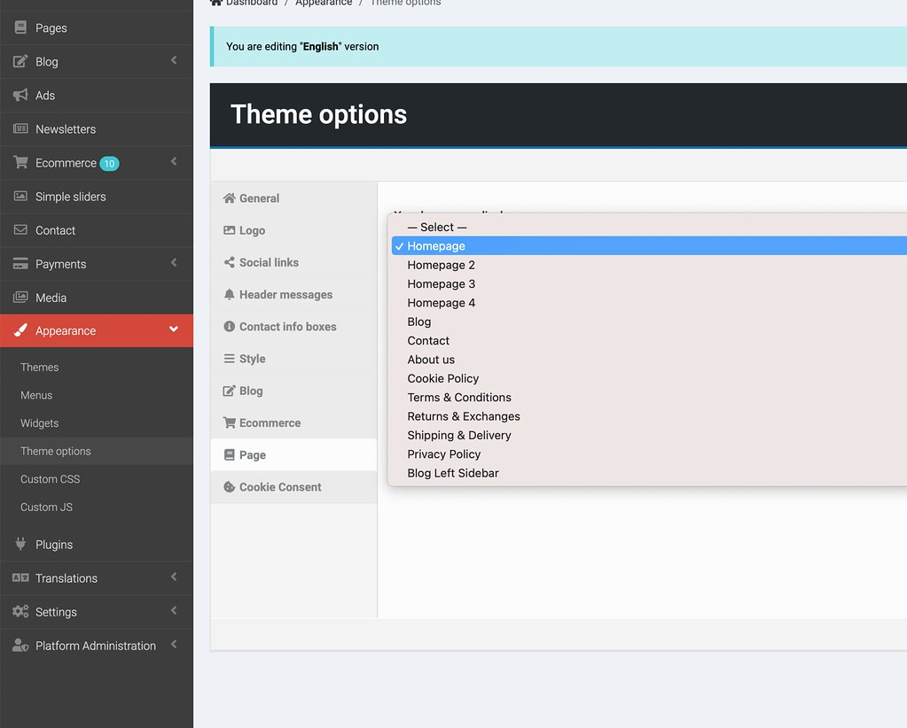
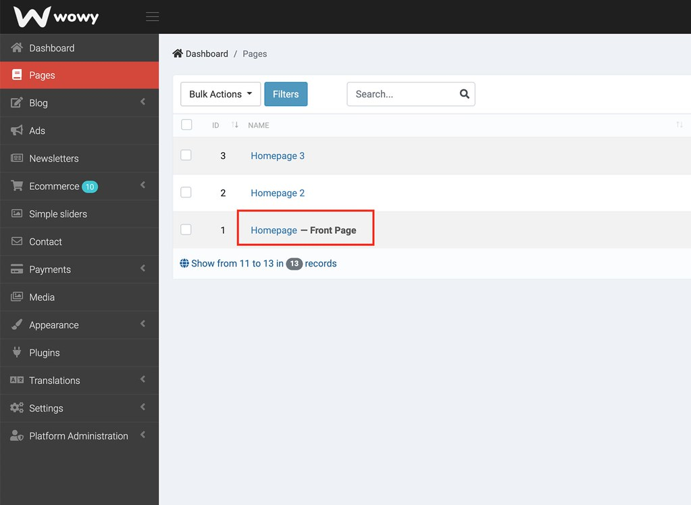
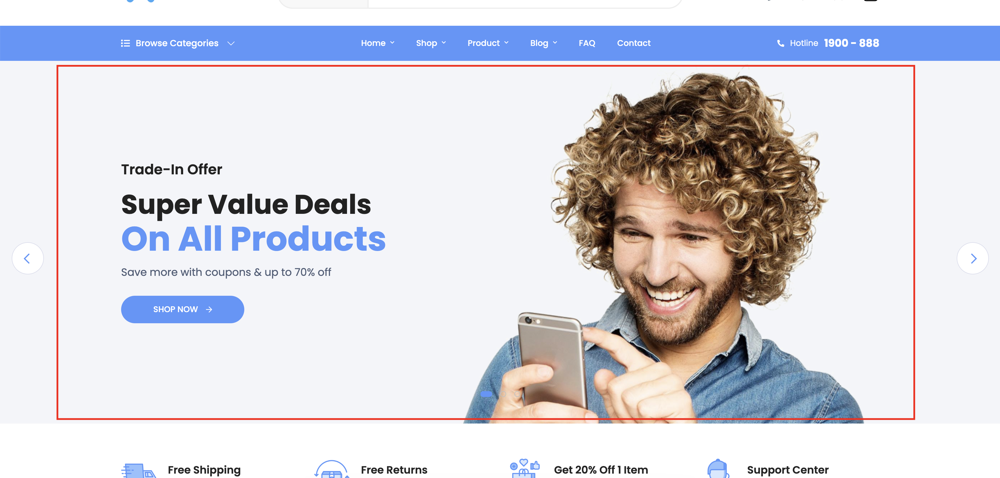
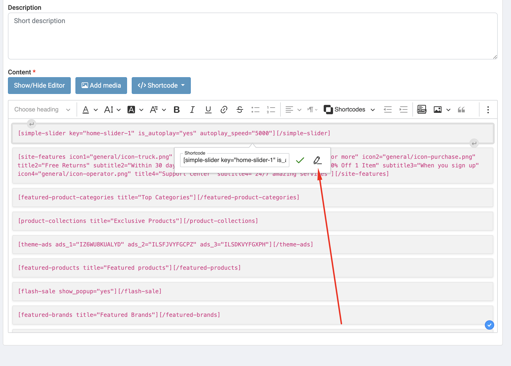
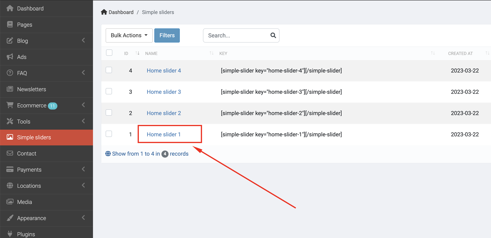
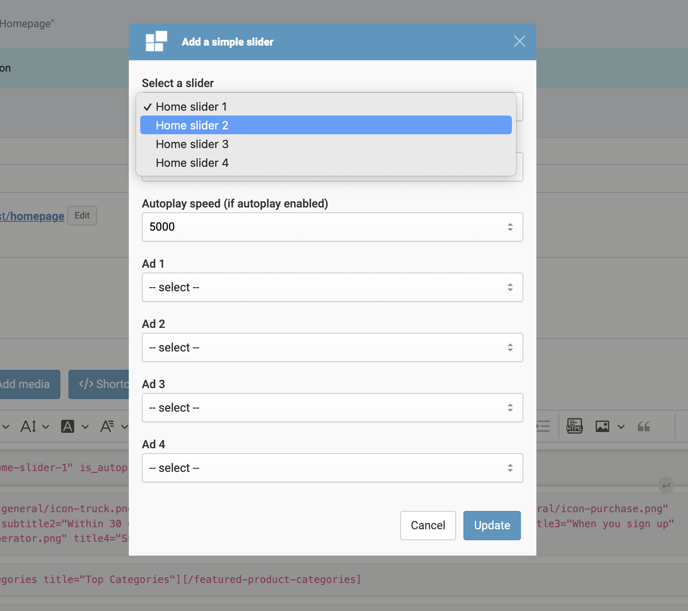

# Homepage

## Setup homepage

- Go to Admin -> Appearance -> Theme options (tab Page) to select a homepage.

Check this video: https://www.loom.com/share/ffa4938e230b410f81bcee3d6ef8fd29

## Customize homepage

- Go to Admin -> Pages -> Select Homepage

Check this video: https://www.loom.com/share/f72e05508c1e43388f66bc7292d85b45

- Home slider.
  

It's shortcode `simple-slider` in the page content.

In this case, it's using the slider with key `home-slider-1`. You can find it in Admin -> Simple Sliders.

You can modify Home Slider 1 or change the key of shortcode to use other sliders.

Check this video: https://www.loom.com/share/56fee46c89ef4ac2b89ab66c34779a15.
