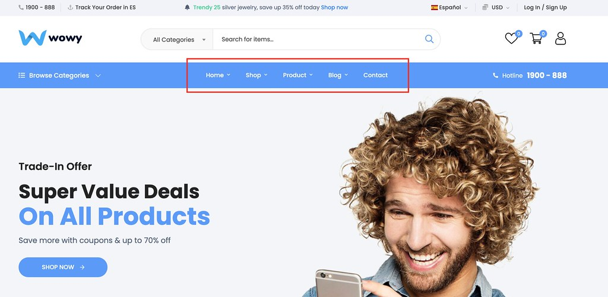
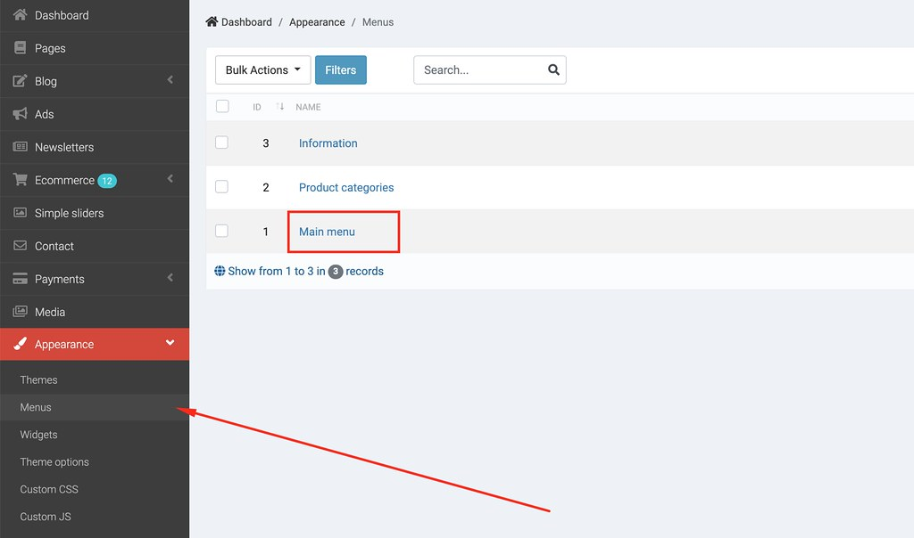
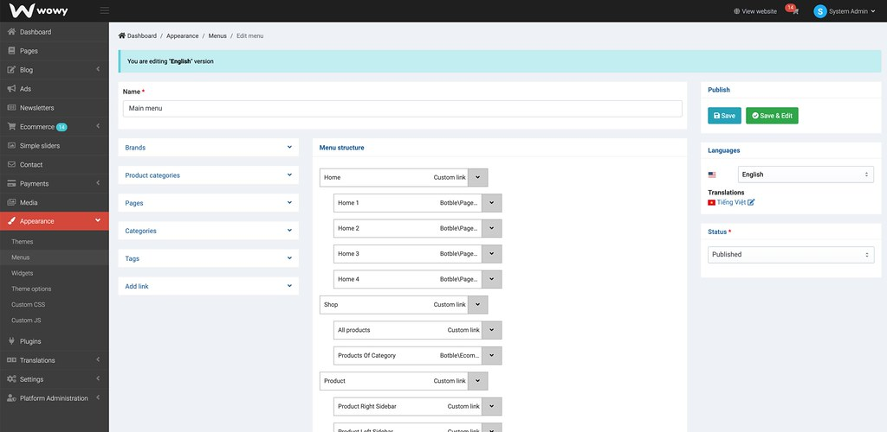
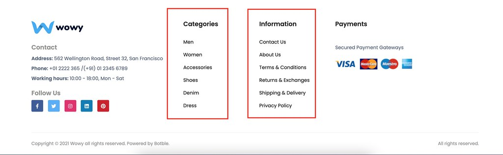
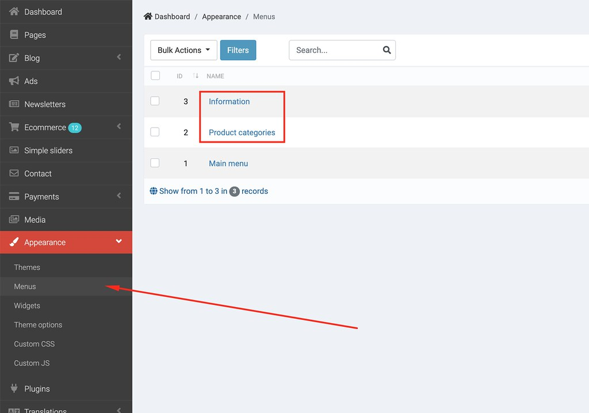

# Menu

## Main menu

- Go to Admin -> Appearance -> Menus (select Main menu)

Drag and drop to change menu items.

## Footer menus

- Go to Admin -> Appearance -> Menus (modify Footer menu & Information)

Check this video: https://www.loom.com/share/b691f3ed85394de08218b4f513a9140d
