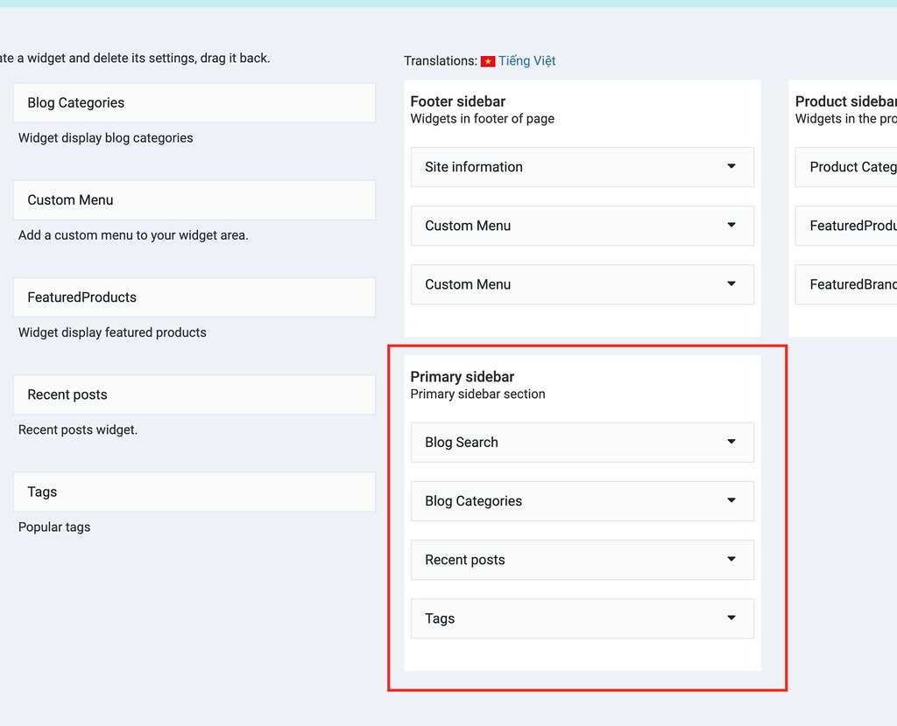

# Widgets

## Footer widgets

- Go to Admin -> Appearance -> Widgets.

You can click on "Delete" button to remove widget from footer sidebar or change the name, selected menu.

If you want to add more widgets, just drag and drop from the left side to sidebar.

Check this video: https://www.loom.com/share/e9fe8bdc4a2b4033809d55f6e0d248fc

## Product sidebar widgets

- Go to Admin -> Appearance -> Widgets.

If you want to disable widgets in the product detail page, you can set product layout in
Admin -> Appearance -> Theme options (tab Ecommerce) and change Product Single Layout to full width.

## Blog sidebar widgets

- Go to Admin -> Appearance -> Widgets.

If you want to disable widgets in the blog page, you can set blog layout in
Admin -> Appearance -> Theme options (tab Blog) and change Blog Single Layout to full width.

And go to Admin -> Pages (select page Blog) then set Template to full width.

