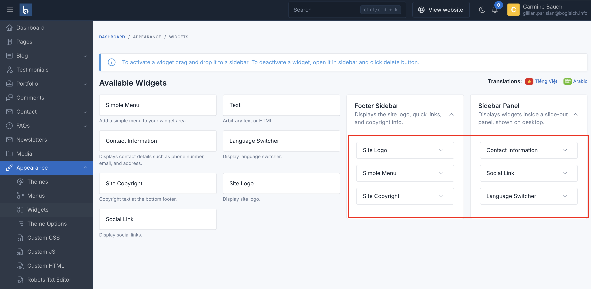
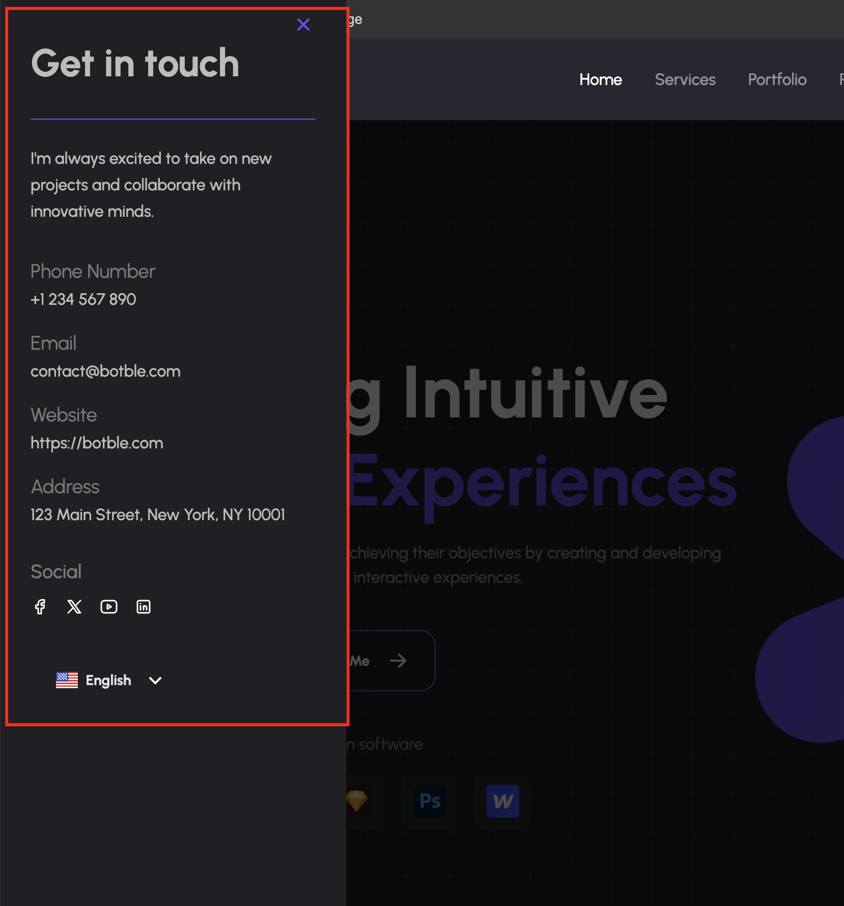
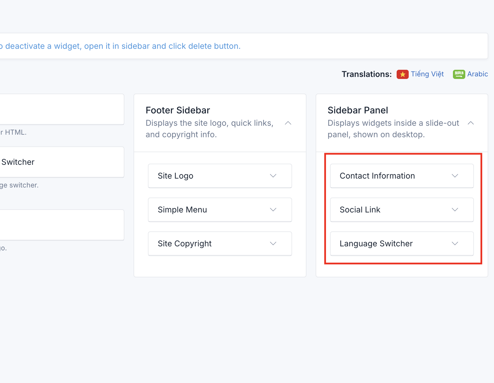
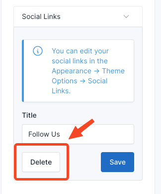

# Widgets

Zelio provides five pre-made widget areas to help you customize the user interface and organize content strategically.

These sidebars offer flexibility in placement and functionality, allowing you to tailor the user experience on different
sections of your website.

## Manage Widgets

To manage the widgets, go to the `Appearance` -> `Widgets` menu in the admin panel.

To add a widget to a sidebar, drag and drop the widget from the left side to the sidebar area on the right side.

## Widget Areas

### 1. Panel sidebar

It appears on the left side of the page. It is suitable for displaying contact information, social links and language switcher.

## Delete Widgets

If you don't want to use the widgets in some areas, you can remove them by collapsing the widget and clicking the
**Delete** button.

